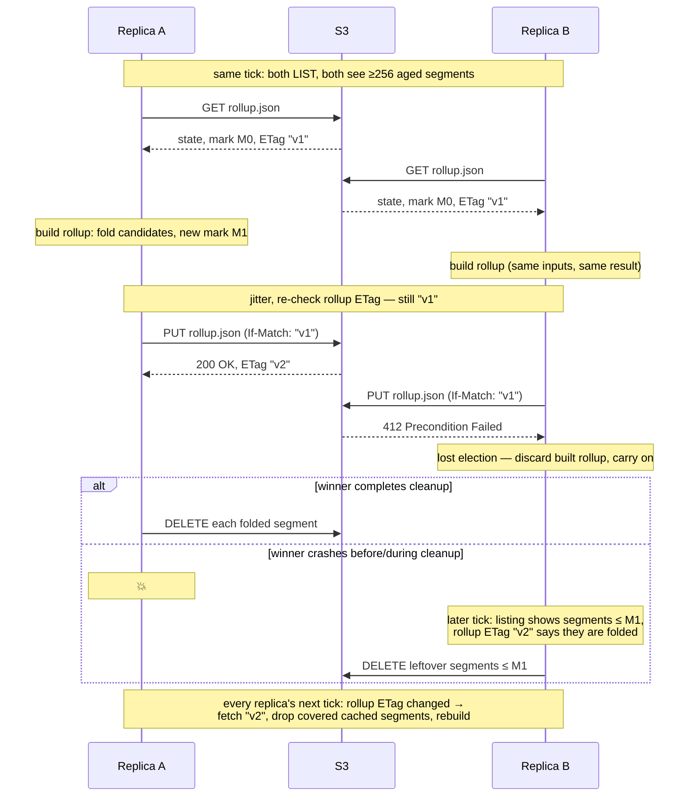

# S3 metadata backend redesign

Status: draft, under iteration.

## Problem

The current S3 metadata backend stores each namespace as a single JSON object
and performs read-modify-write on it under a separate S3 lock object. This is
S3's worst access pattern, and it fails the backend's two production
consumers (the tiered-cache etag map and git clone counts):

- Queries serve local in-memory state that is never refreshed from S3 —
  nothing calls `Flush` in production, and the periodic sync loop was removed
  when writes became synchronous. Replicas never observe each other's writes,
  so cross-replica invalidation does not work, and a restarted replica starts
  empty and stays empty until its first write.
- Every write costs ~4 sequential S3 round trips (lock PUT, state GET, state
  PUT, lock DELETE) on the request path, serialized fleet-wide per namespace
  by the lock object.
- The whole-namespace blob is rewritten on every write, so write cost grows
  with total state size.
- The lock is both racy (stale-lock expiry can delete a freshly acquired
  lock, permitting two holders) and redundant (the ETag CAS on the state
  object already provides the only correctness guarantee).

## Goals and constraints

- Eventually consistent: writes from any replica become visible to all
  replicas within a bounded staleness window. Delayed visibility is
  acceptable; data loss is not.
- All writes are synchronous: `Apply` returns only after the ops are durable
  in S3, and storage errors surface to the caller.
- Queries stay local, synchronous, and cheap — they are on the request hot
  path and callers ignore their errors.
- No replica identity: replicas have no stable IDs and no registration.
- No trusted clocks: replica wall clocks may be arbitrarily skewed.
- No locks. S3 conditional writes (CAS) may be used only off the hot path.
- Requires strong read-after-write and list-after-write consistency from the
  object store (AWS S3 since 2020; MinIO, GCS, R2 all provide it).
- Requires enforced conditional writes (If-Match / If-None-Match on PUT,
  failing with 412 or 409): AWS S3 (2024+) and MinIO. A store that silently
  ignores these headers turns the compaction election into last-write-wins
  with two believed winners, which can delete unfolded segments — support
  must be verified before deploying on other S3-compatibles.
- Requires S3 node clocks to be reasonably synchronized (well under a
  second of skew): LastModified is stamped per-node, and same-writer
  ordering across timestamp granules depends on skew staying below the gap
  between sequential PUTs. Guaranteed on AWS; an NTP requirement for
  self-hosted stores.

## Design

Invert the access pattern: instead of read-modify-write on shared mutable
state, each write appends an immutable segment to a shared per-namespace
journal, and every replica independently derives its state by replaying the
journal in a canonical order that all replicas agree on. S3 is good at
exactly this: unconditional PUTs to unique keys, prefix listing, and cheap
conditional GETs.

### Object layout

```
.metadata/<namespace>/segment-<uuidv7>.json   # immutable op segments
.metadata/<namespace>/rollup.json             # compacted snapshot, CAS'd in place
```

A segment is a JSON-encoded batch of ops (the existing `Op` sum type with a
type discriminator per op; no format version — evolution is handled by
adding new discriminators). The rollup holds the replayed state plus the
high-water mark it covers. The mark's LastModified must be stored exactly
as the listing returned it (full precision preserved): mark comparisons are
bit-exact comparisons against listing values, and a lossy round-trip would
silently corrupt replay filtering and cleanup. Marks must always be derived
from LIST-returned values, never from HEAD/Stat responses — SDK paths
surface different precisions for the same object (minio-go: milliseconds
via LIST, whole seconds via HEAD).

Sketch of the two bodies (illustrative, not exhaustive):

```
segment-<uuidv7>.json:  {"ops": [{"op": "IntMapAdd", "key": ..., ...}, ...]}
                        {"ops": []}                          # clock probe
rollup.json:            {"state": {...},
                         "mark": {"lm": "<LastModified exactly as listed>",
                                  "key": "segment-<uuidv7>.json"}}
                        # zero mark: {"lm": "0001-01-01T00:00:00Z", "key": ""}
```

Every real (LastModified, key) exceeds the zero mark, so a zero-marked
rollup covers nothing.

The root cache namespace is the empty string. MinIO rejects the `//` a raw
empty path component would produce, so the root namespace maps to a
reserved `.root` directory (`.metadata/.root/segment-<uuidv7>.json`) —
collision-free because cache namespaces are validated to never start with
`.`. Its legacy object remains `.metadata/.json`.

There are no per-replica prefixes. Nothing in the design needs writer
identity: sync consumes the union of segments, and compaction covers
everything older than a cutoff regardless of who wrote it. A writer that
disappears is not a special case — its segments age out like any other.

### Canonical order

The canonical order of segments is **(LastModified, key)**, both taken from
the S3 listing.

- LastModified is assigned server-side, by whichever S3 node processes the
  PUT. Replica clocks never participate. There is no monotonicity guarantee
  across S3 nodes, and granularity may be a whole second — neither matters
  for convergence, because the value is stored once with the object and
  every reader sees the same value, so all replicas derive the identical
  order and converge to the identical state. Accuracy is irrelevant;
  agreement is what replay needs.
- Order is arrival order *as stamped*. Folded history is immutable: once
  segments are folded into the rollup their relative order is fixed forever.
  Within the live tail, however, a late-arriving PUT stamped behind by S3
  node skew re-interleaves before segments replicas have already applied.
  This is safe because every replica rebuilds the tail from scratch each
  tick — all replicas sort the same stored values, so all re-derive the same
  adjusted order. (This is a load-bearing argument for full rebuilds over
  incremental insertion.)
- The key breaks ties within LastModified granularity (which can be as
  coarse as one second). Keys embed a UUIDv7, whose millisecond-timestamp
  prefix makes lexicographic order ≈ generation order. The generating
  process's clock is only ever compared against other segments in the same
  LastModified granule, so skew is harmless: same-writer ties resolve in
  write order (the group-commit writer serializes PUTs, and the UUIDv7
  implementation must guarantee strict per-process monotonicity — google/uuid
  does, via a sub-millisecond sequence per RFC 9562); cross-writer ties are
  logically concurrent, so any deterministic order is acceptable.

Known narrow edges, both accepted:

- A process that crashes and restarts within one LastModified granule can
  emit a UUIDv7 that sorts before its pre-crash segment if the clock stepped
  backwards between runs. Closing this requires durable per-writer state,
  which the design deliberately avoids.
- Same-writer inversion across granules: sequential PUTs from one writer are
  at least a round trip apart, but S3 node clock skew exceeding that gap
  *and* crossing a granule boundary would stamp the second PUT behind the
  first, where the UUIDv7 tiebreak cannot help (the stamps differ). The
  symptom is an out-of-order replay of one writer's ops (e.g. Set-then-
  Delete replaying as Delete-then-Set) until a later write supersedes it.
  AWS keeps fleet clocks far tighter than a round trip; self-hosted
  deployments must keep S3 node skew well under a second (standard NTP) —
  this is a documented deployment requirement, not something the design
  defends against, since a full defence (per-writer segment chaining) would
  reintroduce writer identity.

Because replay order is total and identical everywhere, the existing op
semantics carry over unchanged — no CRDT/commutativity redesign, no
last-write-wins timestamps, and deletes are ordinary ops (no tombstone
mechanism: the rollup covers a strict prefix of the order, so absence from
it is unambiguous).

### Write path

Synchronous group commit, per namespace:

- At most one segment PUT is in flight at a time. An `Apply` arriving while
  nothing is in flight PUTs immediately; Applies arriving during a flight
  accumulate into the next batch and all unblock (with the batch's error)
  when their PUT completes.
- There is no time window, and arrivals never join a PUT already in flight.
  They accumulate into the *next* batch, which is PUT as one segment when
  the current flight completes. The in-flight PUT's duration (~10–50 ms) is
  thus the collection window for its successor: with only one PUT ever in
  flight, segments are produced at most one per round trip regardless of
  the Apply rate, so batch size grows with load while object count stays
  flat. Worst-case caller latency is two round trips (the current flight,
  then its own batch's); when idle, exactly one, with no timer-imposed
  floor.
- The PUT is unconditional — the key is unique, so there is no contention,
  no CAS, and no application-level retry loop. SDK-internal retries must be
  bounded: a segment PUT must not be retried beyond the compaction age
  threshold after its first attempt (total deadline < age threshold),
  otherwise a lost success response could re-create the segment after it
  was folded and deleted, replaying its ops twice.
- On success the batch is applied to local state *and* the segment is
  inserted into the local segment cache before callers unblock, so
  read-your-own-writes holds per replica and survives a concurrent sync
  rebuild (a rebuild from a listing taken before the PUT would otherwise
  wipe the write locally for a full interval). The segment's canonical
  position is unknown until it appears in a listing (PUT responses do not
  return LastModified): until first listed, a cached segment orders after
  everything listed, and two unlisted segments order by key — which
  matches write order, since the writer is serialized. Cache entries
  record a local *monotonic* insert time
  — used only for local before/after comparisons against LIST start
  times, so no clock trust is involved (see eviction, below). Until its
  first listing a fresh segment may transiently shadow another replica's
  later-stamped ops locally; the next listing restores canonical order.
- The writer's state-apply + cache-insert and a rebuild's input-snapshot +
  swap are mutually exclusive per-namespace critical sections — the
  snapshot and the swap are *separate* acquisitions, with the replay
  running unlocked between them — and a rebuild re-applies, before
  swapping, any cached segments inserted after its input snapshot was
  taken. Without this, an `Apply` landing
  mid-rebuild would return success and still be wiped by the in-flight
  rebuild's swap until the next tick. All of these paths dedup by segment
  key, with one visibility rule: **staging is invisible to the writer** —
  its dedup check consults the committed cache only. A tick whose LIST
  starts after the PUT completes but before the writer's insert fetches
  the segment into staging; the writer, finding the key uncommitted,
  still applies and inserts (a staged-but-uncommitted segment must not
  suppress state-apply — the tick could abort and discard staging), and
  the rebuild's re-apply then skips the key because staging is part of
  the replay input snapshot (step 5). Conversely, the writer skips
  state-apply and cache-insert when the key is already *committed* —
  sound because commit happens at swap time, so committed implies the
  served state contains the op. Without key dedup, the listing path and
  the writer path would double-apply the same segment's non-idempotent
  ops; without commit-at-swap, a tick that cached a fetch and then
  aborted would make the writer skip state-apply with no rebuild ever
  applying the op — losing read-your-own-writes for a full interval
  despite `Apply` returning success.

Durability is S3's at the moment `Apply` returns. Cost is one round trip per
write (amortized less under concurrency), versus four-plus-lock today.

### Read path and sync

Queries read local in-memory state, synchronously. Freshness is provided by
one background loop per namespace, ticking at a configurable interval
(`sync-interval`, default 15s) with an immediate first tick when the
namespace is created, so a restarted replica converges without waiting a
full interval. Each tick:

1. `ListObjectsV2` the full `segment-` prefix. Every entry carries (key,
   LastModified) — exactly the canonical-order inputs, no extra requests.
2. Conditional GET `rollup.json` (If-None-Match on the cached ETag — 304
   when unchanged; a plain GET on the first tick, when no ETag is cached
   yet). If changed, fetch it and note the new high-water mark.
   The LIST deliberately precedes this: the rollup is then always at least
   as new as the listing, so any segment a racing compaction deleted after
   the LIST is covered by the rollup we hold — a rebuild can never have a
   hole between rollup coverage and tail. (No rollup at all → see
   Migration.)
3. Fetch unseen segments above the rollup's mark (concurrently, bounded)
   into a private staging area — "unseen" is computed against the
   committed cache only, so fetches discarded by an earlier aborted tick
   are simply re-fetched. Staged fetches are committed to the segment
   cache only at swap time (step 5), so "cached" always implies
   "reflected in served state" — the writer's dedup rule depends on this.
   Bodies are parsed at fetch time, so steps 4–5 are pure local
   computation with no abort points. A successful LIST also stamps
   already-cached entries: the first time a cached entry appears in a
   listing it adopts the listed LastModified, clearing its unlisted
   status — this is the transition that restores canonical order for
   fresh local writes and makes them eligible for mark-based eviction.
   Adoption applies to every listed cached entry, including those at or
   below the mark: a folded-but-still-listed local write is evicted at
   step 4 by mark comparison, which needs the stamp adoption just gave
   it. Adopted stamps survive an aborted tick harmlessly — the stamp is
   the object's true immutable LastModified, so keeping it only improves
   ordering and eviction eligibility.
   Any fetch failure — including a 404 from a compaction that deleted the
   segment after step 2 — aborts the tick and discards its staged
   fetches; rebuilding from a partial set is exactly the hole step 2's
   ordering guards against. The next tick self-heals.
4. Evict cached segments covered by the rollup's mark. Additionally,
   evict an *unlisted* cached segment (a fresh local write not yet
   observed in any listing) that is absent from a successful LIST which
   started after its cache insert: its PUT completed before that LIST
   began (list-after-write consistency), and only compaction removes
   segments, so it was folded and its ops are in the rollup this tick
   holds. Without this rule, a writer whose ticks fail across a compaction
   (an S3 blip longer than the age threshold) would replay its folded
   segment forever — a permanent local double-apply that only a restart
   clears. Listing membership governs nothing else — in particular, never
   replay.
5. Rebuild: replay rollup state plus the tick's replay input — the
   key-deduped union of the committed cache and this tick's staged
   fetches, snapshotted when the replay begins — filtered to entries
   whose (LastModified, key) exceeds the rollup's mark, in canonical
   order, into a fresh map, and swap it in. An unlisted entry has no
   stamp and always passes the filter — safe because step 4's
   unlisted-absence eviction has already removed folded ones. When a key
   appears in both the committed cache (unlisted, inserted by the writer
   mid-tick) and staging (with its listed stamp), the stamped copy wins
   the union, and at swap it overwrites the unlisted committed entry —
   only ordering metadata is at stake, since the object is immutable and
   both copies carry identical ops; this is the second of the two
   stamp-adoption paths and always agrees in value with step 3's. The
   late-insert re-apply (see Write path) skips any key present in the
   input snapshot, and staged keys are part of it: a writer inserting a
   segment the tick already staged must not cause a second application. Filtering replay by mark —
   not by listing membership — is what prevents double-apply: between a
   compaction's commit and its cleanup, folded segments are still listed
   and still cached, and replaying them on top of a rollup that already
   contains them would double-count non-idempotent ops such as
   `IntMapAdd`.

The listing is always the full prefix. A lexicographic watermark
(`StartAfter` on the last-seen key) is incorrect: keys sort by the writer's
clock, but discovery must follow arrival order — a skewed-behind clock or a
retried PUT lands a key that sorts before keys already seen, and a watermark
would skip it forever. Full-prefix listing stays cheap because compaction
bounds the live segment count (steady state: one LIST page per tick).

Rebuilds replay everything rather than inserting incrementally; correctness
of ordering is then trivial, and compaction keeps the tail short enough that
this is cheap.

Ticks are mutually exclusive per namespace: `Flush` ("run a sync tick
now", pull-only — nothing is ever pending locally, since writes are
synchronous) waits for any in-flight tick, then runs a full tick of its
own and returns its error. Running a fresh tick — not joining the
in-flight one — gives Flush barrier semantics: its LIST starts after the
Flush call, so every write durable before the call is observed. Two
overlapping ticks could otherwise interleave eviction and swap such that
the older tick installs a state missing ops the newer tick evicted — a
state that never existed remotely. Concurrent Flushes serialize, each
running its own tick, and the tick mutex must be fair (FIFO) so a waiting
Flush cannot be starved by the background ticker; conversely, sustained
Flush traffic must not starve the ladder — after a bounded run of
consecutive Flush ticks, the ticker gets a fair chance. An implementation
may coalesce a Flush into a tick — queued or just started — that has not yet
issued its LIST when the Flush arrives (its LIST then starts after the
Flush call, preserving the barrier); the coalesced Flush completes at
that tick's swap — before the compaction/probe ladder — so it never
sleeps a jitter, never waits on compaction I/O, and never parks on a
future scheduled tick.

A tick aborts at the first failure, discards its staged fetches, and
skips everything after the failure point: a LIST failure (any page —
"successful LIST" always means every page succeeded) aborts before the
rollup step; a rollup GET or seed failure aborts before eviction; a
segment fetch failure aborts before eviction and rebuild. A successfully
fetched rollup (ETag, state, and mark — retained or discarded as one
unit) survives an abort safely: the next tick's step 2 re-validates it
against that tick's fresh LIST — a 304 proves it still current as of a
moment after the new LIST — so the rollup-newer-than-listing invariant
is re-established each tick, independent of anything retained. Failures inside the ladder itself (a probe PUT, a
compaction PUT failing with anything but 412/409, the recheck LIST) do
not retroactively affect the tick — counters and the remembered stamp
were already updated from the tick's main LIST, and ladder errors cost
staleness only, since every condition re-derives from stamps next tick.
The
compaction/probe ladder — including its sustain and stall counters and
the remembered newest-listed-stamp — runs and updates only on successful
*background* ticks: aborted ticks never reach it, and Flush ticks skip it
entirely (so a Flush never sleeps a jitter delay and its latency stays
bounded) and neither advance nor reset any counter.

The loop stops on `Close`, which must be idempotent (the conformance suite
closes a backend more than once). While the bucket is unreachable, queries
keep serving the last-built state and ticks fail without effect. If
compaction can never succeed — credentials lacking DELETE, or conditional
writes silently unsupported — the tail and the segment cache grow without
bound; the backend requires GET/PUT/LIST/DELETE permissions and should log
this failure mode loudly.

### Compaction

Leaderless and opportunistic. No replica is responsible; every replica is
eligible; the bucket listing (which every replica already fetches per tick)
is the only registry. Duplicate attempts waste work but cannot duplicate
effect: the conditional PUT of `rollup.json` is both the election and the
commit, and exactly one racer wins it.

Every replica runs the following at the end of each sync tick, using values
the tick already fetched — the listing (keys + LastModified) and the current
rollup (state, high-water mark, ETag). Thresholds are internal constants
until proven to need tuning.

1. **Candidates.** Select live segments whose age is at least the age
   threshold, where age = the newest LastModified in the listing minus
   the segment's LastModified — both stamps from S3's clock; the
   replica's clock is never consulted (a locally-fast clock would
   otherwise fold, and let cleanup delete, segments that are seconds
   old). This reference errs in the safe direction: it can only
   under-estimate age, so compaction can be delayed, never premature. The
   threshold is max(30s, 2 × sync-interval), so a large configured
   interval cannot outrun aging. (The LIST response's `Date` header would
   be the ideal reference, but SDKs — including minio-go — do not expose
   it.)

   With no newer writes a tail never ages relative to itself, so aging
   can stall: live segments at or above the segment threshold, but too
   few candidates to compact. When that persists for two consecutive
   ticks, a replica — after a random jitter and a recheck, mirroring the
   election's pattern — PUTs a **clock probe**: an empty segment (zero
   ops, a no-op in replay) whose only effect is to advance the reference
   clock. The probe is a raw unconditional PUT outside the group-commit
   writer, never applied locally or cache-inserted (the segment-PUT retry
   deadline need not apply to it: a folded-then-recreated probe is a
   harmless fresh no-op, and a replica key-dedup'ing the recreated key
   against a stale cached copy holds an empty segment either way); it is
   discovered like any other segment on the
   next tick, ages, and is folded away like any other segment. The
   recheck is a fresh LIST: any stamp newer than the stalled window's
   newest means someone else already probed (or wrote), so skip. This
   makes duplicate probes rare, not impossible — two jitters expiring
   within one round trip can both PUT — and duplicates are harmless
   no-ops. The stall counter resets whenever the newest listed stamp
   advances, and the resetting tick then evaluates its own stall
   condition (it can count as the first stalled tick).
2. **Cleanup of leftovers.** Delete any candidate at or below the current
   rollup's high-water mark — these were folded by an earlier compaction
   whose compactor died before finishing its deletes. (Skip the rest of the
   tick for them.)
3. **Trigger.** If fewer than the segment threshold (~256) candidates
   remain, stop. Otherwise require the trigger to have held for two
   consecutive ticks, then wait a small random jitter and re-check the
   rollup ETag — if it changed, another compactor already won; stop. The
   sustain-and-jitter step only reduces wasted duplicate work; skipping it
   would still be correct.
4. **Build.** Replay the rollup state plus all candidates in canonical
   (LastModified, key) order. The result is a new rollup whose high-water
   mark is the greatest (LastModified, key) among the candidates.
5. **Commit (election).** Conditional PUT of `rollup.json`, If-Match on
   the ETag held this tick — a rollup always exists by this point, since
   the tick seeds one when none does (see Migration). On 412 — or the 409
   ConditionalRequestConflict AWS returns for racing conditional writes —
   another replica won; discard the built rollup and stop. This and the
   once-ever migration seed are the only conditional writes in the system.
6. **Cleanup.** On success, delete every folded segment. Failures here are
   ignored: step 2 of any future tick, on any replica, finishes the job.

Cleanup (steps 2 and 6) can never touch a segment younger than the age
threshold: the mark is the maximum of candidates that were all older than
the threshold when folded, so everything at or below it is older still.

A concurrent-compactor race, including the crash-recovery path:



Note that B's losing PUT is not wasted correctness-wise even though its
built rollup is discarded: both compactors folded the same candidates from
the same listing into the same state, so which one wins is immaterial. A
racing compactor that had listed *newer* segments than the winner folded
simply finds them still live next tick — unfolded segments are never lost
by losing an election.

The age threshold is the correctness boundary, and it is measured entirely
in S3's time frame (newest listed stamp minus segment stamp — S3's clock
at both ends; the replica's clock is never consulted). Because
LastModified is assigned at processing time, a PUT
delayed in flight (network stalls, retries, pauses) always receives a
fresh stamp — delay can never produce an old one — and the write path
bounds SDK-internal retries below the threshold, so a lost success
response cannot re-create a segment after it was folded and deleted. The
only remaining way a segment arrives already stamped past the threshold is
S3 node clock skew exceeding it, which violates the sub-second skew
deployment requirement by more than 30×. Accepted residual risk: under
such catastrophic skew, an acknowledged write below the mark could be
cleaned up unfolded and lost — tolerable because the environment is
already broken far beyond this design's contract, and the data is
advisory.

### Rebase

A replica that lags past the compaction cutoff (e.g. a long GC pause or
network partition longer than the tail's retention) has missed segments
that were folded and deleted beneath it. No special detection is needed:
the ordinary tick already handles it. Its next successful tick fetches the
newer rollup, evicts covered segments, fetches the (possibly empty) tail,
and rebuilds — the rebase *is* steps 1–5. This is what makes aggressive
compaction safe.

### Migration (backfill)

The legacy layout (`.metadata/<ns>.json` state object + `.lock`) does not
collide with the new prefix. Legacy state is backfilled lazily, per
namespace: when a sync tick finds no rollup, it GETs the legacy state
object and writes the initial rollup with a **zero high-water mark**
("covers nothing", so every live segment still folds later) — seeded from
the legacy state when present, or **empty when absent**, so "no rollup
exists" is a once-per-namespace transient rather than a per-tick special
case (and the legacy GET really does happen once, as the request table
assumes). Concurrent seeders race safely on If-None-Match:* and carry
identical state. Three rules keep this sound:

- The seed is the only If-None-Match:* creation of `rollup.json`
  (compaction always runs after the tick's seed/fetch step, so it always
  has an ETag to If-Match), and it must first consult the legacy object
  and use its state as the base, so nothing can commit a rollup that
  shadows unseeded legacy state. A losing seeder (412) immediately
  re-GETs the rollup to adopt the winner's ETag and state, so the rest of
  its tick — compaction included — always holds an ETag.
- If the legacy GET fails with anything other than 404 (a transport or
  auth error), the tick aborts (no seed, no rebuild, no compaction):
  proceeding could commit exactly that shadowing rollup. A truncated body
  is a transport error, not a corrupt object: "unparseable" below applies
  only to a *complete* read — body read to clean EOF per the transport
  framing, with length matching Content-Length when one is present
  (chunked responses have none) — otherwise a mid-body connection reset
  would be
  misclassified as corruption, seed an empty rollup, and silently shadow
  intact legacy state forever.
- A legacy object whose complete body is empty or unparseable *as a JSON
  object* (state is an object; a valid JSON scalar or array is equally
  corrupt) is logged loudly and treated as absent. Aborting instead would freeze the
  namespace forever on a permanently corrupt object; the data is advisory.

Legacy objects are left in place; they are only ever consulted when no
rollup exists, so they are inert after seeding. All lock machinery is
deleted.

Constraint: old and new versions must not run against the same bucket beyond
a brief rollout overlap. Old replicas write to the legacy object, which is
read exactly once at seeding — writes landing there afterwards are lost
("afterwards" includes the race window between the seed's legacy GET and
its PUT).
This is tolerable because the data is advisory (etags self-heal against the
authoritative tier; clone counts are approximate), but the overlap should be
kept short.

An explicit one-shot backfill tool was considered and rejected (YAGNI): lazy
seeding migrates every namespace that is actually used, needs no tooling or
operational step, and idle namespaces lose nothing by migrating on first
use.

## HTTP requests by phase

All counts are per namespace. N = live segments; U = of those, unseen by
this replica; C = candidates folded by a compaction.

| Phase | Requests | Notes |
|---|---|---|
| Query | 0 | Always local memory. |
| Write (`Apply`) | 1 PUT per segment | k concurrent Applies group-commit into 1..k PUTs, at most one per round trip. Unconditional, no retry loop. |
| Sync tick (quiet) | 2 | Conditional GET `rollup.json` (304) + 1 LIST page. The steady-state cost. |
| Sync tick (active) | 2 + U GETs | Segment GETs run concurrently. +1 LIST page per additional 1000 live segments; a changed rollup's body rides on the same conditional GET (bytes, not an extra request); + leftover-cleanup DELETEs when observed (normally 0). |
| Compaction (losing attempt) | 2 | Conditional GET re-check after jitter + conditional PUT that loses (412/409). |
| Compaction (winning attempt) | 2 + ⌈C/1000⌉ | Same two, PUT wins, then the C folded candidates deleted via multi-object DeleteObjects (1000 keys/request) — typically 1 since the trigger threshold (~256) is below one batch. |
| Cold start / rebase | 1 + ⌈N/1000⌉ + N GETs | LIST + GET rollup + fetch the whole tail. Compaction bounds N, so typically ≲256 GETs, concurrent. |
| Migration seeding | +2 | Once per namespace ever: GET legacy state object (present or 404) + conditional PUT of the initial rollup (legacy state, or empty when absent), piggybacked on the tick that finds no rollup. |
| Clock probe | 1 LIST + 1 PUT | Only while a quiet namespace's tail is stalled (live ≥ segment threshold, too few candidates, sustained two ticks): recheck LIST after jitter, then the probe PUT. Typically one probe fleet-wide per stalled window (duplicates are harmless no-ops); +1 GET per replica next tick. |

Concretely, a quiet replica at the default 15s `sync-interval` spends 480
requests/hour/namespace, all cheap GET/LIST (plus the rare probe PUT while
a stalled tail waits to age). Writes cost exactly one
request each, down from four sequential round trips under a contended
fleet-wide lock in the current design — and queries, the hot path, cost
zero.

No locks anywhere; the only conditional *writes* are the compaction
election and the once-ever migration seed (conditional reads — the
rollup's If-None-Match GET — happen every tick). Staleness is bounded by
`sync-interval` plus tick duration while ticks succeed; consecutive
failed ticks extend it.

## Deferred / out of scope

- **Time-windowed listing**: listing only objects modified in the last few
  seconds would need LIST-by-time, which S3 does not offer; approximating it
  is not worth the correctness risk. Revisit only if full-prefix listing
  shows up in costs.
- **Etag map growth**: TTL-expired cache entries never delete their entry in
  the tiered etag map, so it grows unboundedly regardless of backend. Needs
  its own reaper; separate design.
- **`RepoCounts.Reap` batching**: should issue one variadic `Apply` instead
  of one per deleted key. One-line follow-up.

## Implementation phases

1. Op wire format: JSON codec for the `Op` sum type with per-op type
   discriminators; round-trip tests.
2. Write path (group commit) and read path (segment cache, canonical-order
   rebuild, sync loop, `Flush`); UUIDv7 monotonicity test; delete lock
   machinery.
3. Rollup compaction, cleanup self-healing, rebase, legacy-state seeding.
4. Config (`sync-interval`; keep `lock-ttl` as a deprecated no-op so
   existing HCL configs still parse), test suite (existing `metadatadbtest`
   suite and soak, plus new tests for coalescing, order ties, compaction,
   rebase, crash-recovery, 409/412, the clock probe, the empty root
   namespace), README sync, lint.

## Example

A walkthrough of the `git` namespace with replicas A and B, then a
cold-starting replica C. UUIDv7s are abbreviated; `sync-interval` is 15s,
age threshold 30s (2× the sync interval), segment threshold lowered to 3
for the example. Ages are measured against the newest stamp in the
listing, per the compaction algorithm.

**t=0 — A records a clone.** `IncrementClone` calls `Apply` with one
`IntMapAdd`. Nothing is in flight, so A PUTs immediately and `Apply` returns
when S3 acknowledges. A applies the op to its local state (read-your-own-
writes). Bucket:

```
.metadata/git/segment-0197a1.json   LastModified 10:00:00
    [IntMapAdd repo_clone_counts "github.com/x/y|2026-07-04" +1]
```

**t=2s — three goroutines on B write concurrently.** The first `Apply`
starts a PUT; the other two arrive mid-flight, queue, and are group-
committed as one segment when the first completes:

```
.metadata/git/segment-0197b2.json   LastModified 10:00:02
    [IntMapAdd ... "github.com/x/y|2026-07-04" +1]
.metadata/git/segment-0197b3.json   LastModified 10:00:02
    [IntMapAdd ... "github.com/x/y|2026-07-04" +1,
     IntMapAdd ... "github.com/p/q|2026-07-04" +1]
```

Four Applies so far, three segments. The two B segments share a
LastModified granule; the UUIDv7 key tiebreak (`b2` < `b3`) preserves B's
write order.

**t=15s — sync tick on A.** LIST returns all three segments. Conditional
GET of `rollup.json` → 404 (none yet), so the tick seeds it: GET of the
legacy `.metadata/git.json` → also 404, and A PUTs an empty rollup with a
zero mark (If-None-Match: \*) → ETag "v0". (Had the legacy object existed,
its state would have seeded "v0" instead.) A then fetches the two segments
it hasn't seen and rebuilds: replay "v0" (empty), then `a1`, `b2`, `b3` in
canonical order, into a fresh map, swap. A now counts x/y=3, p/q=1. B's
tick does the same, loses the seed race benignly, and converges to the
identical state. The live count (3) now meets the segment threshold with
zero aged candidates — the aging-stall condition is met once.

**t=30s — clock probe.** The stall persists a second tick. After jitter,
B PUTs an empty probe segment to advance the reference clock (A's recheck
sees it and skips):

```
.metadata/git/segment-0197p1.json   LastModified 10:00:30
    []                              # zero ops — a clock probe
```

**t=50s — B reaps a stale bucket.** One `Apply`, one segment with an
`IntMapDelete` — a delete is an ordinary op (this one targets a key that
was never written; deleting an absent key is a harmless no-op, carried
and folded like any other op):

```
.metadata/git/segment-0197c4.json   LastModified 10:00:50
    [IntMapDelete repo_clone_counts "github.com/old/repo|2026-01-01"]
```

`c4` advances the reference clock past what `p1` supplied: at the t=45
tick only `a1` (30s against 10:00:30) was aged; by t=60, against
10:00:50, `a1` is 50s old and `b2`/`b3` are 48s.

**t=75s — first compaction.** The three candidates `a1`, `b2`, `b3` meet
the count threshold at the t=60 tick and again at t=75 (sustained two
ticks), while `p1` (20s) and `c4` (0s) are too young and stay live. Both
A and B build the same rollup from the same listing. A wins the race:

```
A: PUT rollup.json (If-Match: "v0")            → 200, ETag "v1"
B: PUT rollup.json (If-Match: "v0")            → 412 — discard, carry on
A: DELETE segment-0197a1, -0197b2, -0197b3
```

Bucket:

```
.metadata/git/rollup.json           ETag "v1"
    state: {repo_clone_counts: {x/y: 3, p/q: 1}}
    mark:  (10:00:02, segment-0197b3)

.metadata/git/segment-0197p1.json   (still live — not folded)
.metadata/git/segment-0197c4.json   (still live — not folded)
```

Had A crashed before its DELETEs, any replica's later tick would find the
three segments at or below "v1"'s mark and delete them (algorithm step 2).

**t=80s — replica C cold-starts.** LIST (two live segments) + GET
`rollup.json` ("v1") + GET `p1` and `c4` → replay rollup state, then `p1`
(a no-op), then `c4`. C converges without ever seeing the folded
segments. If C had instead been a long-partitioned replica whose local
state predated "v1", the same tick is its rebase.

**t=85s — more writes.** C records a clone; A's reaper deletes another
stale bucket (batched with a clone increment by group commit):

```
.metadata/git/segment-0197d5.json   LastModified 10:01:25
    [IntMapAdd repo_clone_counts "github.com/x/y|2026-07-04" +1]
.metadata/git/segment-0197e6.json   LastModified 10:01:25
    [IntMapDelete repo_clone_counts "github.com/old/repo2|2026-02-01",
     IntMapAdd repo_clone_counts "github.com/p/q|2026-07-04" +1]
```

**t=100s and t=118s — two more clones.** B writes `f7` (stamped 10:01:40)
and `g8` (stamped 10:01:58). Each advances the reference clock and resets
the stall counter — without them, the stall condition (live ≥ 3, aged
< 3) would have been met at the t=90 and t=105 ticks and a second probe
would have fired; the organic writes arrive first. By the t=120 tick,
against `g8`'s stamp: `p1` is 88s old, `c4` 68s, `d5`/`e6` 33s — four
candidates — while `f7` (18s) and `g8` (0s) are too young.

**t=135s — second compaction round.** The four candidates qualify at
t=120 and again at t=135; `f7` and `g8` stay live. This
round shows the incremental path: the new rollup's replay starts from
"v1"'s state, not from the beginning of history. C and B race this time
(any replica is eligible), and B's loss surfaces as AWS's 409 variant:

```
C: PUT rollup.json (If-Match: "v1")            → 200, ETag "v2"
B: PUT rollup.json (If-Match: "v1")            → 409 — discard, carry on
C: DELETE segment-0197p1, -0197c4, -0197d5, -0197e6
```

Bucket:

```
.metadata/git/rollup.json           ETag "v2"
    state: {repo_clone_counts: {x/y: 4, p/q: 2}}
    mark:  (10:01:25, segment-0197e6)

.metadata/git/segment-0197f7.json   (still live — not folded)
.metadata/git/segment-0197g8.json   (still live — not folded)
```

The reaped entries are simply absent from "v2" — the deletes were folded as
ordinary ops, and absence from a rollup is unambiguous because it covers a
strict prefix of the order. The probe `p1` folded away as a no-op. On their
next tick, A and B see the rollup ETag change to "v2", fetch it, drop their
cached copies of the folded segments, and rebuild from "v2" + the live tail
(`f7`, `g8`).

Steady state from here: each replica's tick costs one 304 on the rollup and
one LIST page; each write costs one PUT.
