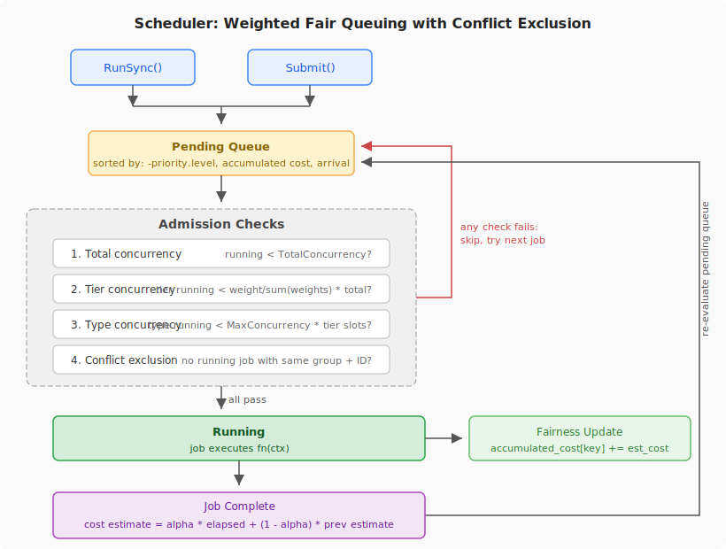

# Scheduler Redesign: Weighted Fair Queuing with Conflict Exclusion

## Problem Statement

The current internal async task queue has a max concurrency limit and sub-queues bounded to 1 for synchronisation. This is insufficient for real-world usage:

1. **Client DoS**: A single client initiated 1000 parallel clones, starving all other clients.
2. **Uniform cost assumption**: All jobs are treated equally, but `linux.git` clone is far more intensive than `git.git` clone.
3. **No foreground/background interaction**: Synchronous (foreground) work contributes to load, but the scheduler can't account for it because only async (background) jobs go through it.

## Design Overview



All work — foreground and background — goes through a single scheduler. The scheduler uses **cost-based fair queuing** to ensure no single client monopolises the system, with **conflict key exclusion** to prevent unsafe concurrent operations on the same resource.

### Core Concepts

**Job**: The unit of work, identified by `(job_type, job_id)`. Optionally carries a `fairness_key` for foreground work.

**Cost**: A `time.Duration` representing the relative system impact of a job. The scheduler automatically learns the cost of each `(job_type, job_id)` pair using an exponential moving average of observed execution time. On first encounter, a small default (1 second) is used. Callers never specify cost explicitly.

**Accumulated cost**: A running total of cost consumed per fairness key. Every time a job is admitted, its estimated cost is added to its fairness key's accumulated cost. The scheduler always picks the job whose fairness key has the lowest accumulated cost — whoever has consumed the least goes next.

**Fairness key**: An opaque string on the job, populated by the caller. For foreground jobs, this is typically the client IP or identity. For background jobs, this is empty. The scheduler doesn't know what it represents — it just uses it for ordering.

**Conflict group**: A named group on the job type config. Two jobs conflict if they share a `job_id` and belong to the same non-empty conflict group. For example, `sync-clone`, `repack`, and `pull` all belong to the `"git"` conflict group — at most one of these can run on a given repo at a time. `snapshot` has no conflict group, so it runs concurrently with anything. This avoids the error-prone per-type conflict lists and ensures symmetry automatically.

**Priority**: A struct with `Level` (dispatch ordering) and `Weight` (share of total concurrency). Priority is a property of a scheduling tier, not an individual job type — multiple job types share the same `Priority` value.

**Total concurrency**: A global cap on the maximum number of concurrently running jobs across all tiers, configured via `Config.TotalConcurrency`.

**Weight**: Each priority tier has a `Weight`. The scheduler divides `TotalConcurrency` among tiers proportionally: a tier's slot allocation is `Weight / sum(all tiers' weights) * TotalConcurrency`. For example, with `TotalConcurrency=50`, a foreground tier with weight 4 and a background tier with weight 1 get 40 and 10 slots respectively.

**Max concurrency (per type)**: A fraction (0–1) of the tier's computed slot allocation that a single job type may consume. For example, `MaxConcurrency: 0.3` on a type in a tier with 10 slots means at most 3 concurrent jobs of that type. The floor is 1, so every registered type can always run at least one job.

### Job Model

```go
// JobType is a named string type for type safety. Constants are defined
// by the application, not the scheduler package, keeping the scheduler
// agnostic to domain concepts like git.
type JobType string
```

### Priority and Job Type Configuration

```go
// Priority defines a scheduling tier with dispatch ordering and a share of
// total concurrency. Two Priority values with the same Level are the same
// tier and must have the same Weight.
type Priority struct {
    Level  int     // higher = dispatched first
    Weight float64 // weight for dividing TotalConcurrency among tiers
}

type ConflictGroup string

type JobTypeConfig struct {
    MaxConcurrency float64       // fraction (0-1) of tier's slots this type may use
    ConflictGroup  ConflictGroup // jobs in same group conflict on same job_id
    Priority       Priority      // scheduling tier this job type belongs to
}
```

Example registrations:

```go
// Application-level constants, not in the scheduler package
var (
    PriorityForeground = scheduler.Priority{Level: 10, Weight: 4}
    PriorityBackground = scheduler.Priority{Level: 5, Weight: 1}
)

const (
    JobTypeSyncClone scheduler.JobType = "sync-clone"
    JobTypeRepack    scheduler.JobType = "repack"
    JobTypePull      scheduler.JobType = "pull"
    JobTypeSnapshot  scheduler.JobType = "snapshot"

    ConflictGroupGit scheduler.ConflictGroup = "git"
)

scheduler.RegisterPriority(PriorityForeground)
scheduler.RegisterPriority(PriorityBackground)

scheduler.RegisterType(JobTypeSyncClone, scheduler.JobTypeConfig{
    MaxConcurrency: 1.0,
    ConflictGroup:  ConflictGroupGit,
    Priority:       PriorityForeground,
})

scheduler.RegisterType(JobTypeRepack, scheduler.JobTypeConfig{
    MaxConcurrency: 0.3,
    ConflictGroup:  ConflictGroupGit,
    Priority:       PriorityBackground,
})

scheduler.RegisterType(JobTypePull, scheduler.JobTypeConfig{
    MaxConcurrency: 0.3,
    ConflictGroup:  ConflictGroupGit,
    Priority:       PriorityBackground,
})

// No ConflictGroup — never conflicts with anything
scheduler.RegisterType(JobTypeSnapshot, scheduler.JobTypeConfig{
    MaxConcurrency: 0.5,
    Priority:       PriorityBackground,
})
```

With `TotalConcurrency=50`: foreground gets `4/(4+1) * 50 = 40` slots, background gets `1/(4+1) * 50 = 10` slots. Repack can use at most `0.3 * 10 = 3` of those background slots.

### Calling Patterns

Foreground (synchronous) — the caller blocks until the job completes:

```go
func (s *Scheduler) RunSync(
    ctx context.Context,
    jobType JobType,
    jobID string,
    fairnessKey string,
    fn func(ctx context.Context) error,
) error
```

```go
err := scheduler.RunSync(
    ctx,
    JobTypeSyncClone,
    "github.com/torvalds/linux",
    request.RemoteAddr,
    func(ctx context.Context) error {
        return cloneRepo(ctx, "github.com/torvalds/linux")
    },
)
```

Background (async) — returns immediately, job runs when admitted:

```go
func (s *Scheduler) Submit(
    jobType JobType,
    jobID string,
    fn func(ctx context.Context) error,
)
```

```go
scheduler.Submit(
    JobTypeRepack,
    "github.com/torvalds/linux",
    func(ctx context.Context) error {
        return repackRepo(ctx, "github.com/torvalds/linux")
    },
)
```

Both enter the same pending queue and the same admission logic. `RunSync` blocks on a completion signal before returning to the caller.

## Dispatch Algorithm

The entire scheduling algorithm:

```
sort pending jobs by (-priority.level, accumulated_cost[fairness_key], arrival_time)

for each job in sorted order:
    if total_running >= config.total_concurrency → skip
    tier_slots = tier.weight / sum(all tier weights) * total_concurrency
    if count(running where priority.level == job.priority.level) >= tier_slots → skip
    type_slots = max(1, int(type.max_concurrency * tier_slots))
    if type_running_count >= type_slots → skip
    if any running job has same job_id AND same non-empty conflict_group → skip
    admit job
    estimated_cost = cost_estimates[(job_type, job_id)] or 1s
    accumulated_cost[fairness_key] += estimated_cost
```

When a job completes:

```
elapsed = wall time since job started
cost_estimates[(job_type, job_id)] = α * elapsed + (1-α) * cost_estimates[(job_type, job_id)]
re-evaluate pending queue for newly admissible jobs
```

Key properties of this algorithm:

- **Total concurrency**: a hard global cap prevents the system from being overloaded regardless of tier configuration.
- **Priority**: foreground always dispatched before background. Background only runs in capacity not used by foreground.
- **Proportional tier allocation**: each priority tier gets a share of total concurrency based on its `Weight` relative to all other tiers' weights. This makes configuration scale-independent — changing `TotalConcurrency` adjusts all tiers proportionally.
- **Per-type limits**: within a tier, individual job types can be capped to a fraction of the tier's allocation, preventing expensive operations from monopolising the tier.
- **Fairness**: within a priority level, jobs from the fairness key with the lowest accumulated cost go first. A client that has consumed a lot of capacity yields to one that has consumed little.
- **Cost-awareness**: expensive jobs advance accumulated cost faster, so they naturally yield to cheaper work from other clients. A `linux.git` clone that takes 60 seconds advances the client's accumulated cost by ~60s, while a `git.git` clone that takes 5 seconds advances it by ~5s.
- **Adaptive**: the scheduler automatically learns the cost of each `(job_type, job_id)` pair. No manual cost tuning required. After one execution, estimates are already meaningful.
- **Conflict safety**: conflicting jobs on the same resource stay in the pending queue, not consuming concurrency slots while they wait.
- **No head-of-line blocking**: if the next job by ordering is blocked (conflict or concurrency limit), the scheduler skips it and admits the next admissible job.

## Cost Estimation

The scheduler maintains an exponential moving average of observed wall time per `(job_type, job_id)`:

```
estimatedCost = α * observedWallTime + (1-α) * estimatedCost
```

`α` is the smoothing factor (0–1) controlling how quickly estimates adapt. `α = 0.3` is a reasonable default — it converges to the true value within a handful of runs, while remaining stable against outliers (e.g., a single slow clone due to network congestion won't drastically inflate the estimate). Should be a configurable constant.

Wall time directly measures the resource being rationed — how long a job holds a concurrency slot. On first encounter of a `(job_type, job_id)` pair, a small default (1 second) is used. After one execution, the estimate is based on real data.

The estimates map needs TTL-based cleanup, same as the accumulated cost map. Estimates could optionally be persisted across restarts to avoid cold-start inaccuracy, using the existing persistence layer.

## Accumulated Cost Lifecycle

The accumulated cost map needs periodic cleanup since fairness keys (client IPs) are ephemeral — thousands of agentic workstations may spin up and down. Options:

- **TTL-based eviction**: remove entries not seen for N minutes.
- **Periodic reset**: zero all counters every N minutes.
- **Advance idle keys**: when a key is seen again after being idle, advance it to the current global minimum (prevents penalising returning clients, prevents exploiting fresh counters).

Start with TTL-based eviction and refine based on production behaviour.

## Go Implementation Notes

### Building Blocks

- `golang.org/x/sync/semaphore` — *not* needed. The weighted semaphore approach was considered and rejected in favour of simple concurrency counting, which avoids starvation issues with high-cost jobs.
- `container/heap` — useful for the priority queue ordering.
- `sync.Cond` or channel — for waking the dispatch loop when a job completes.

### Synchronisation Concern

The previous implementation conflated synchronisation (mutex per resource) with scheduling. In this design, synchronisation is handled by conflict groups within the scheduler. There is no external mutex — the scheduler itself ensures jobs in the same conflict group don't run concurrently on the same resource by keeping them in the pending queue.

### Persistence

The existing persistence layer for scheduled jobs (recording last execution time to avoid thundering herd on restart) remains unchanged. It's orthogonal to the scheduling algorithm.

### Prior Art

The Kubernetes API Priority and Fairness system (`k8s.io/apiserver/pkg/util/flowcontrol/fairqueuing`) solves a very similar problem for the kube-apiserver. It uses priority levels, flow distinguishers (fairness keys), shuffle sharding, and work estimation in "seats" (cost). The KEP is worth reading for context:

https://github.com/kubernetes/enhancements/blob/master/keps/sig-api-machinery/1040-priority-and-fairness/README.md

The k8s implementation is too coupled to the apiserver to use as a library, but the design concepts directly informed this approach. Our design is simpler: no shuffle sharding (explicit fairness keys instead), no dynamic reconfiguration, and we add conflict key exclusion which k8s doesn't have.
